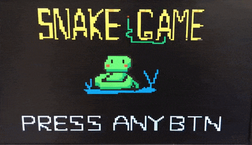
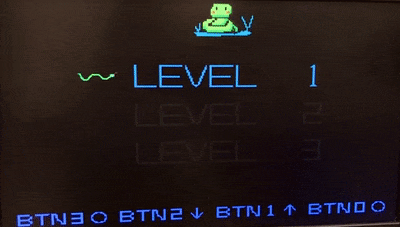
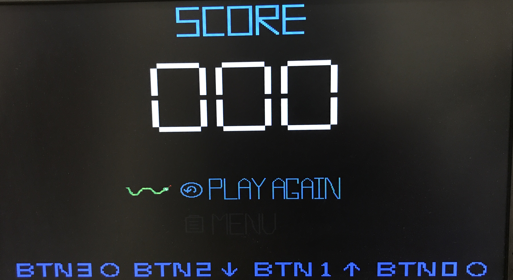

# Verilog Implementation of the addictive mobile game, Snake

        

## Nokia's Snake, an all time classic

> Launched in 1997 with Nokia 6110, Snake is said to have signalled a new era in mobile gaming but it was the game’s second version in 2000 that became a household name. 
> 
> PIA KRISHNANKUTTY 18 July, 2020 02:00 pm IST

## How to play??

### 1.Greetings

   

A green coloured snake greets the player, press any button would proceed to the level selection state.

### 2.Select your level to play

   

There are 3 levels to challange, with respective game time, player could hit buttons to switch between states and select them by pushing at the  select button. There's instrucion print on the bottom part of the screen. The threee levels are: 

|  Level 1   | Level 2  | Level 2  |
|:----:|:----:|:----:|
|60 seconds| 90 seconds| 105 seconds|
|  | | |

### 3.Play the game

The four buttons, representing going up, down, left and right manoeuvers the snake to avoid the wall and obstacles, If the snake ran into a wall, the Health Point would drop constantly (every second) until the game is over. The goal of the game is to collect as many points as possible, in ordrer to score points, you have to gather apples and cherries spread accross the entire map by running over them. Under the gaming page, there's a countdown clock at the left upper corner. The clock tells the remaining time player has got and would turn into vibrant red and start blinking when it reaches a final 10 second countdown.

Watch our demo video on Youtube 

### 4.Game Over

The game ends when 

